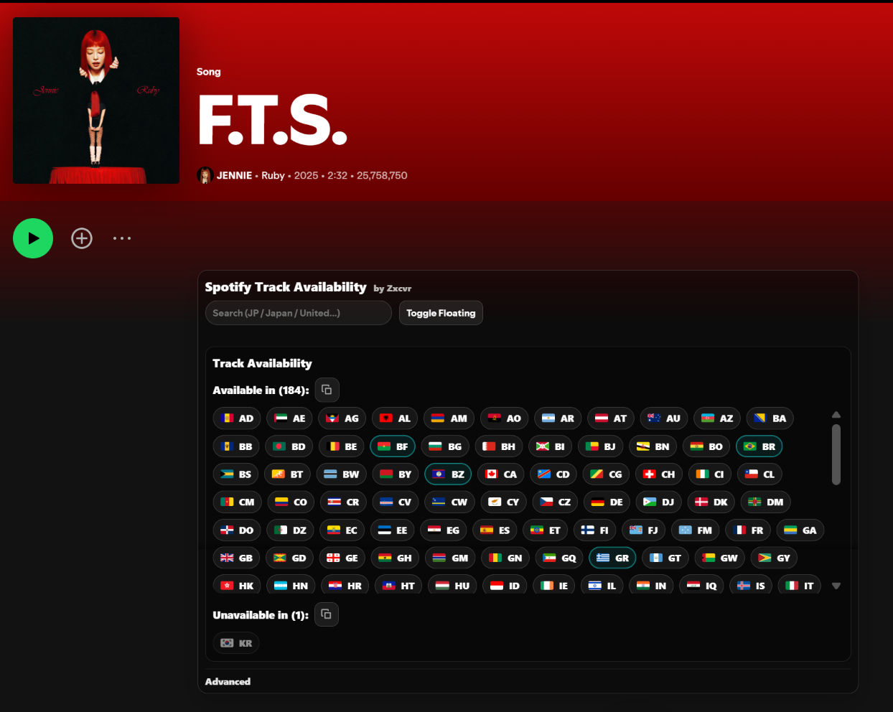

# 🎧 Music Availability — Various Platforms (Web Browser UserScripts)

Check whether a **track/album is available in other regions** on supported music platforms — directly on the official site, with a clean in-page panel (**search, copy, progress bar, floating/minimize, persistent preferences**).

<!-- ⚡ Quick Install -->

  
  &nbsp;&nbsp;
  
  &nbsp;&nbsp;
  

---

  
<b>📚 Table of Contents</b> (click to expand)

- [📸 Showcase](#-showcase)
- [💡 Why this exists](#-why-this-exists)
- [✨ Core UI/UX features](#-core-uiux-features)
- [🎵 Platforms](#-platforms)
  - [ TIDAL](#-tidal)
  - [ Qobuz](#-qobuz)
  - [ Spotify](#-spotify)
- [🧩 Requirements](#-requirements)
- [▶️ How to use](#️-how-to-use)
- [🛠️ Troubleshooting](#️-troubleshooting)
- [🤝 Contributing (PRs welcome)](#-contributing-prs-welcome)
- [🧾 Credits](#-credits)

---

## 📸 Showcase

###  TIDAL

###  Qobuz

###  Spotify

---

## 💡 Why this exists

Licensing differs by country, so the same link can be **available in one region and blocked in another**.

This helps you quickly answer:
- 🌍 “Which countries have this track/album?”
- 🚫 “Where is it unavailable?”
- 🧩 “Which storefront/region should I check next?”
- 📋 “Give me the region list so I can share it / document it.”

Perfect for curators, archivists, collectors, and anyone comparing catalogs across countries.

---

## ✨ Core UI/UX features

Shared across supported platforms for consistency:

- ⚡ **Auto-start scan** after a short delay (page mounts first)
- 🔎 **Search filter**: `Search (JP / Japan / United...)` (ISO or country name)
- 📋 **Copy icons** next to section titles (copies only visible results after filtering)
- 🏁 **Thin scanning progress bar** + live `Scanning… X/Y`
- 🧷 **Floating panel** toggle (bottom-right) + **Minimize/Expand**
- 💾 **Remembers UI state globally** (floating on/off + minimized)
- ⭐ **Advanced → Preferred countries** (choose default country(s) to always highlight; saved globally)
- 🏳️ **Flags + ISO chips** with graceful fallback (flags auto-hide if blocked)
- 🧠 **Live results while loading**, then final output is **alphabetically sorted** (A→Z) where applicable
- 📦 **Compact scroll containers** for long country lists (especially Spotify)

---

## 🎵 Platforms

##  TIDAL

### ✅ What it does
Checks **TIDAL track/album** availability across regions using TIDAL’s API (`countryCode`).

### 🌐 Supported URLs
- `tidal.com`
- `www.tidal.com`
- `listen.tidal.com`

### 🌍 Region coverage
- Scans **61 TIDAL-supported regions**

### 🔐 Login
- ✅ No login required (guest-friendly token capture + fallback token)

### ✅ What “available” means
A region is **available** if TIDAL’s API returns a valid response for that track/album under the given `countryCode`.

### ⬇️ Install (TIDAL)

  
  &nbsp;
  

---

##  Qobuz

### ✅ What it does
Checks **Qobuz track/album** availability across **official Qobuz storefront countries** by loading localized product pages.

### 🌐 Supported URLs
- `qobuz.com`
- `www.qobuz.com`
- `open.qobuz.com`
- `play.qobuz.com`

### 🌍 Region coverage
- Scans **26 official Qobuz storefront countries**

### 🔐 Login
- ✅ No login required

### ✅ What “available” means
A region is **available** if the localized Qobuz storefront page loads and looks like a valid product page (not an error / “not available” page).

### 🔗 Bonus
- ✅ Available chips open the matching Qobuz storefront page

### ⬇️ Install (Qobuz)

  
  &nbsp;
  

---

##  Spotify

### ✅ What it does
Checks **Spotify track/album** availability across countries using the item’s `available_markets`.

### 🌐 Supported URLs
- `open.spotify.com`

### 🔐 Login
- ✅ Works on the web player (guest mode is fine; token is fetched from Spotify web)

### ✅ What “available” means
A country is **available** if it appears in Spotify’s `available_markets` list for that track/album.

### ⬇️ Install (Spotify)

  
  &nbsp;
  

---

## 🧩 Requirements

You need a userscript manager:

- ✅ [Violentmonkey](https://violentmonkey.github.io/) (recommended)
- ✅ [Tampermonkey](https://www.tampermonkey.net/)
- ✅ Greasemonkey (Firefox)

Supported browsers:
- ✅ Chrome / Chromium (Chrome, Edge, Brave, Opera, Vivaldi)
- ✅ Firefox

---

## ▶️ How to use

### General
1. Install the script for your platform
2. Open any **track** or **album** page
3. The panel auto-starts after a short delay
4. Use:
   - 🔎 Search to filter
   - 📋 Copy to export region lists
   - 🧷 Floating/Minimize to keep it out of the way
   - ⭐ Advanced → Preferred countries to highlight your defaults

---

## 🛠️ Troubleshooting

- ❓ **Panel not showing:** ensure you’re on a real **track/album** page (not home/search).
- 🏳️ **Flags missing:** your network may block flag hosts — ISO codes still work.
- ⏳ **Slow scan / occasional unknowns (TIDAL):** rate limits happen; rerun by reloading the page.
- 🧱 **UI moved on SPA navigation:** scripts auto-re-mount on navigation; if layout changes, open an issue/PR.

---

## 🤝 Contributing (PRs welcome)

Contributions are welcome — especially:
- ➕ adding more platforms (Deezer / Apple Music / Amazon / etc.)
- 🧼 UI consistency improvements (keep it clean + compact)
- 🚀 performance optimizations that **don’t reduce correctness**
- 🧪 edge-case fixes for new layouts / endpoints

### 🧵 How to contribute
1. Fork the repo
2. Create a branch: `feature/your-change`
3. Commit your changes
4. Open a PR with a clear description (screenshots appreciated for UI changes)

---

## 🧾 Credits

Made by **Zxcvr**.
